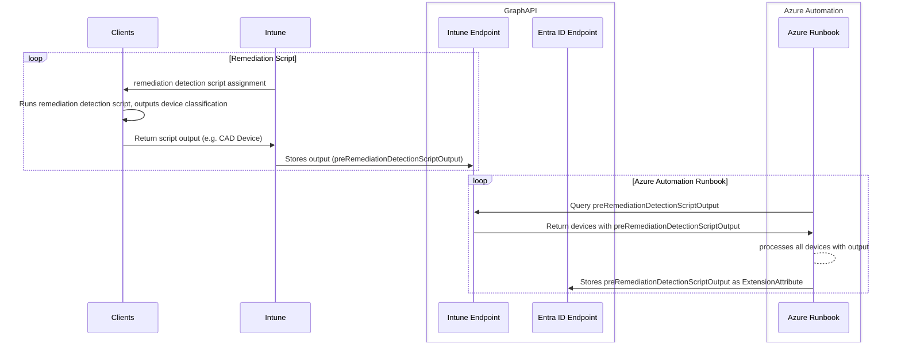

# Intune Device Classification

Classifies, tags or categorize devices so that dynamic Entra ID groups can be created based on device classification.

## Overview

This solution has two main components:

- **Intune Remediation Script**
- **Azure Automation Runbook**

The **Intune Remediation Script** determines the classification of a device (e.g. CAD Device) and outputs the classification to the GraphAPI. This is fully customizable and can be used to classify devices based on any criteria.

The **Azure Automation Runbook** queries the GraphAPI for devices that have been classified and stores that device classification in a custom attribute (`extensionAtrribut1-15`) in Entra ID.



## Software Requirements

- Microsoft Visual Studio Code (`winget install vscode`)
- Polyglot Notebooks [Marketplace](https://marketplace.visualstudio.com/items?itemName=ms-dotnettools.dotnet-interactive-vscode)
- Markdown Preview Mermaid Support (optional) [Marketplace](https://marketplace.visualstudio.com/items?itemName=bierner.markdown-mermaid)
- .net 8.0 (`winget install Microsoft.DotNet.SDK.8`)

## Setup

1. Clone this repo
2. Open the repo in vscode
3. Create .env file in the root of the repo

    ```text
    TenantID="yourtenant.onmicrosoft.com"
    SubscriptionID="yoursubscriptionid"
    AppRegistrationName="Intune Device Classification"
    CertifcateName="Intune Device Classification Certificate"
    PubCertifcateFileName="IntuneDeviceClassificationCert.cer"
    PrivCertifcateFileName="IntuneDeviceClassificationCert.pfx"
    AutomationAccountName="aa-intunedeviceclassification"
    ResourceGroupName="rg-deviceclassification"
    Location="eastus"
    Plan="Basic"
    ClearValue="clear"
    DeviceClassificationList="CAD,Kiosk,Special Device,clear"
    ExtensionAttribute="extensionAttribute13"
    RemediationScriptName="Device Classification"
    AppConnectionName="AzureAppConnection"
    RunBookName="rb_intunedeviceclassification"
    DailyScheduleTime="23:00"
    ```

4. Open the `IntuneDeviceClassification.ipynb` notebook
5. Run the notebook (with vcode extension)
