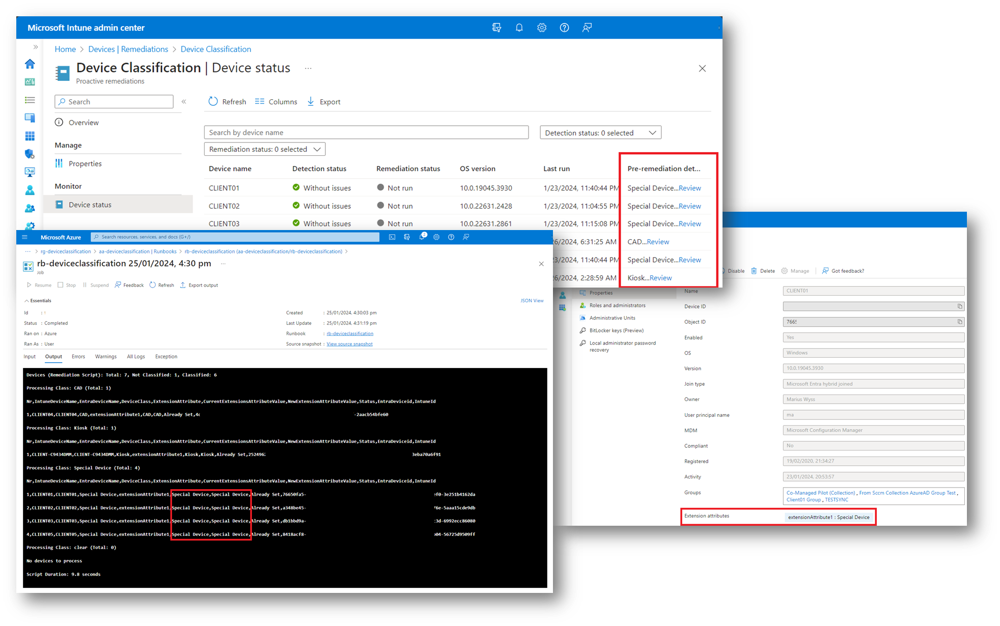

# Intune Device Classification

<p align="center">
  
</p>

---

***<p style="text-align: center;">«Classifies, tags or categorize devices so that dynamic Entra ID groups can be created based on device classification.»</p>***

---

## Overview

This solution has two main components:

- **Intune Remediation Script**
- **Azure Automation Runbook**

The **Intune Remediation Script** determines the classification of a device (e.g. CAD Device) and outputs the classification to the GraphAPI as `preRemediationDetectionScriptOutput`. This is fully customizable and can be used to classify devices based on any criteria.

The **Azure Automation Runbook** queries the GraphAPI for devices that have been classified and stores that device classification in a custom attribute (`extensionAttribute1-15`) in Entra ID.


<p align="center">
  
</p>

## Software Requirements

- Windows PowerShell > 7.2 (Other OS support is being looked at)
- Git
- Microsoft Visual Studio Code
- Polyglot Notebooks
- Markdown Preview Mermaid Support (optional)
- .net 8.0 SDK

```powershell
# Install Pre-Requisites
# PowerShell 7.4 or higher, Git, .net 8.0 SDK, VSCode
winget install --id Microsoft.PowerShell --accept-source-agreements --accept-package-agreements
winget install --id git.git --accept-source-agreements --accept-package-agreements
winget install --id Microsoft.DotNet.SDK.8 --accept-source-agreements --accept-package-agreements
winget install --id Microsoft.VisualStudioCode --accept-source-agreements --accept-package-agreements

# If vscode was freshly installed, run this or restart shell
$env:Path = [System.Environment]::GetEnvironmentVariable("Path","Machine") + ";" + [System.Environment]::GetEnvironmentVariable("Path","User")

# Install VSCode Extensions
code --install-extension ms-dotnettools.dotnet-interactive-vscode
code --install-extension bierner.markdown-mermaid
```

## Setup

1. Clone this repo
2. Open the repo in vscode
3. Copy `template.env` to `.env` file in the root of the repo
4. Update the `.env` file with your values
5. Open the `IntuneDeviceClassification.ipynb` notebook
6. Run the notebook (with Polyglot Notebooks extension)

```powershell
# Navigate to your git repo folder
cd your\path\to\gitrepos

# Clone the repo
git clone https://github.com/MrWyss-MSFT/IntuneDeviceClassification.git
cd IntuneDeviceClassification

# Open the repo in vscode
copy template.env .env
code . .\.env .\IntuneDeviceClassification.ipynb
```

## Demo (Cut and sped up video)

>**NOTE:** The complete setup may take up to 20 minutes in real-time.

<video src="https://github.com/MrWyss-MSFT/IntuneDeviceClassification/assets/53998264/2d64534d-3cfe-4c5b-9a87-8020813231eb" controls title="Cut and Fast Demo Video"></video>

## Usage

### Intune Remediation Script

The remediation script can be customized to classify devices based on any criteria. Make sure it returns a short string (e.g. CAD Device) and exits with a 0 exit code. The string needs to be added to the `DeviceClassificationList` in the Azure Automation Variable, so that the script processes the device classification.

**ClearValue** is used to clear the classification and therefore clear the `extensionAttribute` in Entra ID. The value of `ClearValue` needs to match with `ClearValue` variable value in the Azure Automation Account. This was a design decision to prevent accidental clearing of the `extensionAttribute` in Entra ID and to limit the number of GraphAPI calls.

### Azure Automation Runbook

The Azure Automation Runbook is scheduled to run daily. It queries the GraphAPI for devices that have been classified and stores that device classification in a custom attribute (`extensionAttribute1-15`) in Entra ID.

## Some design decisions

- No client component, other than what Intune already provides (remediation script).
- No secrets on the clients
- limit the number of GraphAPI calls
- extensionAttribute in favor of Intune Category as there is only one Intune Category per device
- Works with Entra ID joined and Hybrid Entra ID joined devices
- Works with and without ConfigMgr co-management
- The Runbook is scheduled to run daily. This is to limit the number of GraphAPI calls. Increase the frequency doesn't make sense as the device classification doesn't change that often and the remediation script does not run that often.

## Other considerations

- Selecting the extensionAttribute1-15 needs to be done carefully. Check with your other teams if they are using any of the extensionAttributes.

## Costs

As of now, I don't have a good estimate of the costs. I will update this section once I have a better idea. The Azure Automation Runbook is scheduled to run daily and the runtime depends on how many devices need to be classified. See Azure Automation pricing for more details here: <https://azure.microsoft.com/en-us/pricing/details/automation/>
